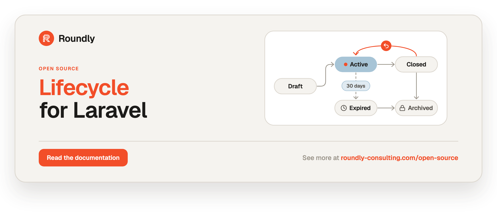
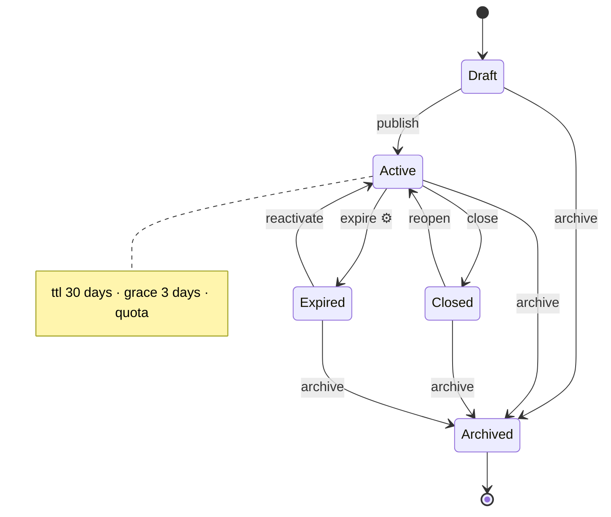

<!-- roundly-hero:start -->
<p align="center">
  <a href="https://roundly-consulting.com/open-source/docs/lifecycle-for-laravel?utm_source=github&utm_medium=readme&utm_campaign=open-source&utm_content=lifecycle-for-laravel">
    
  </a>
</p>
<!-- roundly-hero:end -->

<!-- roundly-badges:start -->
<p align="center">
  <a href="https://packagist.org/packages/roundly-consulting/lifecycle-for-laravel"></a>
  <a href="https://github.com/roundly-consulting/lifecycle-for-laravel/actions/workflows/run-tests.yml"></a>
  <a href="https://github.com/roundly-consulting/lifecycle-for-laravel/actions/workflows/fix-php-code-style-issues.yml"></a>
  <a href="https://donate.stripe.com/dRmeVe8FX5PF1Qd9pXcEw00"></a>
  <a href="https://www.patreon.com/cw/roundly"></a>
  <a href="https://roundly-consulting.com/support-us?utm_source=github&utm_medium=readme&utm_campaign=open-source&utm_content=lifecycle-for-laravel#crypto"></a>
</p>
<!-- roundly-badges:end -->

# Lifecycle for Laravel

Status lifecycles for any Eloquent model with a status — orders, tickets, listings,
subscriptions, applications. A state machine for Eloquent models: named transitions behind one
guard pipeline, limits and race-free quotas, expiry and scheduled transitions, rollbacks and an
append-only history.

| Model | Typical lifecycle |
|---|---|
| Order | pending → paid → shipped, refunded; payment status as a second lifecycle |
| Ticket | new → open → waiting → resolved, reopened at most 3 times |
| Listing | draft → active → expired after 30 days, at most 5 active per customer |
| Subscription | trial → active → grace → cancelled, renewed or reactivated |
| Application | submitted → in review → approved or rejected, undo within an hour |

- **Define once** — states (a backed enum or strings), an initial state, terminal states and named
  transitions (several sources, `*` wildcard) in a small definition class. Several lifecycles per
  model (`status`, `payment_status`).
- **Restrictions** — Gate abilities, actor rules, system-only transitions, required reasons, payload
  validation, custom guards, deadlines, freezes and seals. Every refusal is a structured,
  translated `Denial`, so `can()`, `check()` and `allowedTransitions()` can drive your UI.
- **Limits** — maximum occurrences, cooldowns, minimum time in a state, per-actor or per-subject rate
  limits and **race-free quotas** ("at most 5 active listings per user").
- **Expiry and scheduling** — per-state TTLs (an interval, a closure or a datetime column), grace
  periods, "expiring soon" warnings that fire exactly once, extend/renew, and any transition
  scheduled for later. One `lifecycle:sweep` runs them all, inline or on a queue.
- **Rollbacks and history** — undo the last transition or roll back to a point in the history, with
  windows, irreversible transitions, attribute snapshots, compensating handlers and restored
  schedules and counters. History is append-only: actor, reason, context and snapshot per row.
- **Safe under concurrency** — a row lock plus a compare-and-swap write per transition, a documented
  lock order, after-commit events and idempotency keys; proven race-free under real concurrent load
  on PostgreSQL and MySQL.
- **Developer experience** — `Lifecycles::for($model)` handles, a `HasLifecycle` trait, query scopes, a
  cast, validation rules, API resources, Mermaid/DOT graphs, seven Artisan commands (including a
  `make:lifecycle` generator) and a real `Lifecycles::fake()`.

## What makes it different

- **Quotas that hold.** "At most 5 active listings per customer" is enforced by the engine, not by a
  count before the save — two simultaneous requests cannot both take the last slot.
- **Time is built in.** States expire, warn once before they do, sit in a grace period, and can be
  extended, renewed or scheduled for later — one scheduled command runs it all.
- **Undo is a feature, not a migration.** Roll back the last change or to a point in history, with
  time windows, irreversible steps, compensating handlers and conflict detection.
- **A real test fake.** `Lifecycles::fake()` refuses what the real engine refuses structurally,
  remembers its own freezes and schedules, and ships assertions for every change it records.

## Contents

- [What makes it different](#what-makes-it-different)
- [Requirements](#requirements)
- [Installation](#installation)
- [Quick start](#quick-start)
- [Configuration](#configuration)
- [Usage](#usage)
  - [Defining a lifecycle](#defining-a-lifecycle)
  - [Making a model a subject](#making-a-model-a-subject)
  - [Applying transitions](#applying-transitions)
  - [Asking before acting](#asking-before-acting)
  - [Restrictions](#restrictions)
  - [Limits and quotas](#limits-and-quotas)
  - [Handlers, hooks, stamps and snapshots](#handlers-hooks-stamps-and-snapshots)
  - [Expiry](#expiry)
  - [Scheduled transitions and the sweep](#scheduled-transitions-and-the-sweep)
  - [Freezing](#freezing)
  - [Rollbacks and history](#rollbacks-and-history)
  - [Querying](#querying)
  - [Strict writes and drift](#strict-writes-and-drift)
  - [Model-level helpers, definitions and graphs](#model-level-helpers-definitions-and-graphs)
  - [API resources, validation and the cast](#api-resources-validation-and-the-cast)
  - [Without the facade](#without-the-facade)
  - [Events](#events)
  - [Console commands](#console-commands)
  - [Testing with the fake](#testing-with-the-fake)
  - [Concurrency and database notes](#concurrency-and-database-notes)
  - [Evolving a definition](#evolving-a-definition)
- [Testing](#testing)

## Requirements

- PHP 8.4
- Laravel 12.x or 13.x
- SQLite, PostgreSQL or MySQL/MariaDB (tested on SQLite, PostgreSQL 16 and MySQL 8). The package's
  tables must live in the same database as the models that have a lifecycle.

## Installation

```bash
composer require roundly-consulting/lifecycle-for-laravel
```

The migrations create polymorphic columns. If your models (or users) use UUID or ULID keys, set the
key types **before** migrating:

```dotenv
LIFECYCLE_KEY_TYPE=uuid          # your models with a lifecycle: bigint (default), uuid or ulid
LIFECYCLE_ACTOR_KEY_TYPE=bigint  # your users
```

Publish and run the migrations:

```bash
php artisan vendor:publish --tag="lifecycle-migrations"
php artisan migrate
```

Optionally publish the config file and the translations (English and Slovak ship with the package):

```bash
php artisan vendor:publish --tag="lifecycle-config"
php artisan vendor:publish --tag="lifecycle-translations"
```

If any state has a TTL, or you schedule transitions, run the sweep every minute (`php artisan
about` and `lifecycle:validate` tell you when it is missing). Pruning is optional:

```php
// routes/console.php
use Illuminate\Support\Facades\Schedule;

Schedule::command('lifecycle:sweep')->everyMinute();
Schedule::command('lifecycle:prune')->daily();
```

## Quick start

Generate a definition class (`app/Lifecycles/ListingLifecycle.php`), from a backed enum or as a small
string-state example to edit:

```bash
php artisan make:lifecycle ListingLifecycle --enum="App\Enums\ListingStatus"
```

```php
enum ListingStatus: string
{
    case Draft = 'draft';
    case Active = 'active';
    case Closed = 'closed';
    case Expired = 'expired';
    case Archived = 'archived';
}
```

```php
use RoundlyConsulting\Lifecycle\Definition\LifecycleBuilder;
use RoundlyConsulting\Lifecycle\Definition\LifecycleDefinition;

final class ListingLifecycle extends LifecycleDefinition
{
    public function define(LifecycleBuilder $lifecycle): void
    {
        $lifecycle->states(ListingStatus::class)
            ->initial(ListingStatus::Draft)
            ->terminal(ListingStatus::Archived);

        $lifecycle->state(ListingStatus::Active)
            ->ttl('30 days')->grace('3 days')->warnBefore('7 days', '1 day')
            ->expiresVia('expire')
            ->quota(5, scope: 'user_id')
            ->stamps('published_at');

        $lifecycle->transition('publish')
            ->from(ListingStatus::Draft)->to(ListingStatus::Active)
            ->ability('publish')
            ->allowSystem();

        $lifecycle->transition('close')
            ->from(ListingStatus::Active)->to(ListingStatus::Closed)
            ->rules(['note' => 'nullable|string|max:500']);

        $lifecycle->transition('reopen')
            ->from(ListingStatus::Closed)->to(ListingStatus::Active)
            ->maxOccurrences(3)->cooldown('1 hour')->requiresReason()
            ->rules(['note' => 'nullable|string|max:500']);

        $lifecycle->transition('expire')
            ->from(ListingStatus::Active)->to(ListingStatus::Expired)
            ->systemOnly();

        $lifecycle->transition('reactivate')
            ->from(ListingStatus::Expired)->to(ListingStatus::Active);

        $lifecycle->transition('archive')
            ->from('*')->to(ListingStatus::Archived)
            ->irreversible();
    }
}
```

```php
use Illuminate\Database\Eloquent\Model;
use Illuminate\Database\Eloquent\SoftDeletes;
use RoundlyConsulting\Lifecycle\Concerns\HasLifecycle;
use RoundlyConsulting\Lifecycle\Contracts\LifecycleSubject;

final class Listing extends Model implements LifecycleSubject
{
    use HasLifecycle;
    use SoftDeletes;

    protected $guarded = [];

    public function lifecycleDefinitions(): array
    {
        return ['status' => ListingLifecycle::class];
    }

    protected function casts(): array
    {
        return ['status' => ListingStatus::class, 'published_at' => 'datetime'];
    }
}
```

```php
use Illuminate\Support\Facades\Gate;
use RoundlyConsulting\Lifecycle\Facades\Lifecycles;

Gate::define('publish', fn (User $user, Listing $listing): bool => $listing->user_id === $user->id);

$listing = Listing::query()->create(['user_id' => $user->id]);  // status = draft

Lifecycles::for($listing)->by($user)->apply('publish');

$listing->status;                         // ListingStatus::Active
$listing->published_at;                   // now
Lifecycles::for($listing)->expiresAt();   // now + 30 days (the sweep runs "expire" 3 days later)
```

A new model starts in the initial state. From then on, the state changes only through transitions.
Saving a changed `status` directly throws (see [Strict writes and drift](#strict-writes-and-drift)).

## Configuration

The published `config/lifecycle.php`:

```php
return [
    'key_type' => env('LIFECYCLE_KEY_TYPE', 'bigint'),
    'actor_key_type' => env('LIFECYCLE_ACTOR_KEY_TYPE', 'bigint'),

    'models' => [
        'state' => LifecycleState::class,
        'transition' => LifecycleTransition::class,
        'schedule' => LifecycleSchedule::class,
    ],

    'subjects' => [],

    'strict_writes' => env('LIFECYCLE_STRICT_WRITES', true),

    'actor' => [
        'from_auth' => env('LIFECYCLE_ACTOR_FROM_AUTH', true),
        'guard' => env('LIFECYCLE_ACTOR_GUARD'),
    ],

    'transactions' => [
        'attempts' => 3,
        'mysql_read_committed' => env('LIFECYCLE_MYSQL_READ_COMMITTED', true),
    ],

    'history' => [
        'store_payload' => env('LIFECYCLE_HISTORY_STORE_PAYLOAD', true),
        'max_context_bytes' => 16384,
        'reason_max_length' => 1000,
        'purge_on_force_delete' => env('LIFECYCLE_HISTORY_PURGE_ON_FORCE_DELETE', true),
        'prune_after_days' => env('LIFECYCLE_HISTORY_PRUNE_AFTER_DAYS'),
    ],

    'rollback' => [
        'default_window' => env('LIFECYCLE_ROLLBACK_DEFAULT_WINDOW'),
        'max_steps' => 50,
    ],

    'schedules' => [
        'batch_size' => 500,
        'max_per_run' => 10000,
        'max_attempts' => 5,
        'retry_after' => '5 minutes',
        'queue' => [
            'enabled' => env('LIFECYCLE_QUEUE_SWEEPS', false),
            'connection' => env('LIFECYCLE_QUEUE_CONNECTION'),
            'name' => env('LIFECYCLE_QUEUE'),
        ],
        'prune_after_days' => env('LIFECYCLE_SCHEDULES_PRUNE_AFTER_DAYS', 30),
    ],

    'rate_limits' => [
        'prefix' => 'lifecycle',
    ],

    'graph' => [
        'default_format' => 'mermaid',
    ],
];
```

| Key | Type | Default | Env | Purpose |
|---|---|---|---|---|
| `key_type` | `bigint`\|`uuid`\|`ulid` | `bigint` | `LIFECYCLE_KEY_TYPE` | Id type of the subject columns the migrations create. Set before migrating. |
| `actor_key_type` | `bigint`\|`uuid`\|`ulid` | `bigint` | `LIFECYCLE_ACTOR_KEY_TYPE` | Id type of the actor columns (who transitioned, froze, scheduled). |
| `models.state` | class-string | `LifecycleState` | — | Swap the state-record model for your subclass. |
| `models.transition` | class-string | `LifecycleTransition` | — | Swap the history model for your subclass. |
| `models.schedule` | class-string | `LifecycleSchedule` | — | Swap the schedule model for your subclass. |
| `subjects` | list of model class-strings | `[]` | — | Your models with a lifecycle. `lifecycle:validate` without arguments checks every lifecycle of every listed model, including the columns its definition names. Models work without being listed. |
| `strict_writes` | bool | `true` | `LIFECYCLE_STRICT_WRITES` | Saving a directly changed lifecycle attribute throws `DirectStateWriteException`. |
| `actor.from_auth` | bool | `true` | `LIFECYCLE_ACTOR_FROM_AUTH` | With no `by()`, the authenticated user is the actor. |
| `actor.guard` | ?string | `null` | `LIFECYCLE_ACTOR_GUARD` | The auth guard for `from_auth` (`null` = the default guard). |
| `transactions.attempts` | int 1–10 | `3` | — | How often a transaction is retried after a deadlock (only when the package opened the outermost transaction). |
| `transactions.mysql_read_committed` | bool | `true` | `LIFECYCLE_MYSQL_READ_COMMITTED` | MySQL/MariaDB: a transaction that counts a quota runs at READ COMMITTED. Off: it keeps your isolation and the quota count takes locking reads. See [Concurrency and database notes](#concurrency-and-database-notes). |
| `history.store_payload` | bool | `true` | `LIFECYCLE_HISTORY_STORE_PAYLOAD` | Keep the validated payload (minus `sensitive()` keys) in the history row. |
| `history.max_context_bytes` | int 1024–1048576 | `16384` | — | JSON size cap of the stored context; larger is refused as `invalid_payload`. |
| `history.reason_max_length` | int 1–10000 | `1000` | — | Longer reasons are refused as `reason_too_long`. |
| `history.purge_on_force_delete` | bool | `true` | `LIFECYCLE_HISTORY_PURGE_ON_FORCE_DELETE` | Force-deleting a subject deletes its records, history and schedules. |
| `history.prune_after_days` | ?int 1–36500 | `null` | `LIFECYCLE_HISTORY_PRUNE_AFTER_DAYS` | `lifecycle:prune` default for history rows (`null` = never). Limits survive pruning; rollback points and idempotency keys older than the cutoff do not. |
| `rollback.default_window` | ?interval | `null` | `LIFECYCLE_ROLLBACK_DEFAULT_WINDOW` | How long a transition stays reversible when it declares no window (`"7 days"`; `null` = unlimited). |
| `rollback.max_steps` | int 1–1000 | `50` | — | Most rows one `rollbackTo()` may revert. |
| `schedules.batch_size` | int 1–10000 | `500` | — | Rows per sweep batch. |
| `schedules.max_per_run` | int 1–1000000 | `10000` | — | Most schedules one sweep run handles. |
| `schedules.max_attempts` | int 1–100 | `5` | — | Attempts before a retryable scheduled transition is marked failed. |
| `schedules.retry_after` | interval | `5 minutes` | — | Delay before a refused, errored or frozen scheduled transition is tried again. |
| `schedules.queue.enabled` | bool | `false` | `LIFECYCLE_QUEUE_SWEEPS` | The sweep dispatches one job per due schedule instead of running it inline. |
| `schedules.queue.connection` | ?string | `null` | `LIFECYCLE_QUEUE_CONNECTION` | Queue connection of those jobs. |
| `schedules.queue.name` | ?string | `null` | `LIFECYCLE_QUEUE` | Queue name of those jobs. |
| `schedules.prune_after_days` | ?int 1–36500 | `30` | `LIFECYCLE_SCHEDULES_PRUNE_AFTER_DAYS` | `lifecycle:prune` default for finished schedule rows (`null` = never). |
| `rate_limits.prefix` | string | `lifecycle` | — | Prefix of the rate-limiter keys of `rateLimit()` transitions. |
| `graph.default_format` | `mermaid`\|`dot` | `mermaid` | — | Graph format when none is given. |

Booleans accept `true/false/1/0/yes/no/on/off` (an empty value is false); any other value throws
the toolkit's `InvalidConfigurationException`, so a typo never silently falls back to the default.
`key_type` and `actor_key_type` accept only `bigint`, `uuid` or `ulid` (case-insensitive); anything
else, an empty value included, throws the same toolkit exception during `migrate` and `about`.
A number or interval outside its range throws `InvalidLifecycleConfigurationException`.
`php artisan about` shows a **Lifecycle** section.

## Usage

### Defining a lifecycle

A definition extends `LifecycleDefinition` and declares everything in `define()`. It is compiled
once per process, validated (errors throw `InvalidLifecycleDefinitionException` with every issue
listed) and then immutable. The class is built with `new`, never through the container. Put
dependencies into guards, handlers and hooks given as class names; those are resolved from the
container on every run. `define()` must not read request state; dynamic values belong in closures.

**`LifecycleBuilder`**

| Method | Meaning |
|---|---|
| `states(ListingStatus::class)` / `states(['draft', 'active'])` | Every case of a backed enum (string or int), or a list of cases or strings. |
| `initial($state)` | The state a new model starts in. Exactly one. |
| `terminal(...$states)` | Final states — nothing leaves them. |
| `state($state)` | A `StateBuilder` for one state's settings. |
| `transition('name')` | A `TransitionBuilder`. Names: letters, digits, `_ . : -`, up to 64 characters. |
| `guard($guard)` | A guard every transition of this lifecycle runs. |
| `label('…')`, `meta([...])` | Display label and free-form metadata. |

**`StateBuilder`**

| Method | Meaning |
|---|---|
| `label('…' \| fn () => …)` | Display label. Default: the enum's `label()` when it has one, else the headline of the value, through the translator. |
| `ttl('30 days' \| fn (Model $m) => interval\|instant\|null)` | Time to expiry after entering the state. |
| `expiresAtAttribute('ends_at')` | The model's own datetime column is the expiry instant (`null` = never). |
| `grace('3 days')` | Extra time between expiry and the expiry transition running. |
| `warnBefore('7 days', '1 day')` | `LifecycleExpiring` warnings (up to 16 leads). |
| `expiresVia('expire')` | The transition that runs on expiry. It must leave this state and be `systemOnly()` or `allowSystem()`. |
| `quota($max \| fn (Model $m) => int, scope: 'user_id' \| [...], name: null)` | At most `$max` models of this table in this state per scope. |
| `minDwell('1 hour')` | Minimum time in the state before user transitions may leave it. |
| `sealedAfter('14 days')` | After this time in the state, it can no longer be left. |
| `stamps('published_at', …)` | Columns set to "now" whenever the state is entered by a transition. |
| `onEnter($hook)`, `onExit($hook)` | `StateHook` (class, instance or closure) run inside the transaction. |
| `meta([...])` | Free-form metadata. |

**`TransitionBuilder`**

| Method | Meaning |
|---|---|
| `from(...$states)` | Source states; `'*'` = every non-terminal state except the target. |
| `fromAnyExcept(...$states)` | The wildcard minus the listed states. |
| `to($state)` | The target state. |
| `allowSelf()` | Allow `from` to contain `to` (a self-transition keeps `entered_at` and its schedules). |
| `systemOnly()` / `allowSystem()` | Only system code / users and system code. Without either, system code is refused. |
| `requiresActor()`, `actors(User::class, …)`, `actor(fn (?Model $actor, Model $subject) => bool)` | Actor rules. |
| `ability('publish')` | Gate ability, checked as `Gate::forUser($actor)->allows('publish', [$subject, $context])`. |
| `requiresReason(int $minLength = 1)` | A reason is required (user context). |
| `rules([...], [...messages])`, `sensitive('card_number', …)` | Payload validation. Only validated keys are kept; sensitive keys are never stored. |
| `when($guard, code: null, message: null)` | A custom guard: class, instance or closure. |
| `notBefore('available_from' \| fn (Model $m) => ?instant, offset: null)` | Not allowed before an instant. |
| `notAfter('deadline' \| fn (Model $m) => ?instant, offset: null)` | Not allowed after an instant. The instant itself is still allowed. |
| `maxOccurrences(3)` | Per subject; counted from the state record, so pruning history never resets it. |
| `cooldown('1 hour')` | Minimum time between two runs of this transition (user context). |
| `rateLimit(10, '1 hour', RateLimitScope::Actor)` | Through Laravel's `RateLimiter`; per `Actor`, `Subject` or `ActorAndSubject`. |
| `ignoresFreeze()`, `ignoresSeal()`, `ignoresMinDwell()` | Exemptions. |
| `handledBy($handler)` | A `TransitionHandler` (class, instance or closure) run inside the transaction. |
| `irreversible()`, `reversible(within: '1 hour', withoutCompensation: false)` | Rollback rules. |
| `rollbackRequires('ability')`, `rollbackGuard($guard)` | Who may roll this transition back. |
| `snapshots('price', …)` | Attributes captured before and after, restored on rollback. |
| `label('…')`, `meta([...])` | Display label and free-form metadata. |

Durations are `CarbonInterval`, `DateInterval` or strings such as `'30 days'`. Months and years never
overflow (31 January + 1 month = 28 February), and days are exact (30 days = 720 hours across a
daylight-saving change). All package timestamps are stored in UTC.

Run `php artisan lifecycle:validate --strict` in CI: it lists every error **and** warning
(unreachable states, dead ends, ambiguous targets, handlers that make a transition irreversible)
and checks that the columns a definition names exist. List your models in `lifecycle.subjects` so
it has something to check: with nothing listed, `--strict` fails instead of passing vacuously.

### Making a model a subject

```php
final class Order extends Model implements LifecycleSubject
{
    use HasLifecycle;

    public function lifecycleDefinitions(): array
    {
        // attribute => definition; the first one is the default lifecycle
        return ['status' => OrderLifecycle::class, 'payment_status' => PaymentLifecycle::class];
    }
}

Lifecycles::for($order)->apply('pay');                         // the first lifecycle (status)
Lifecycles::for($order, 'payment_status')->apply('authorize'); // another one
```

The lifecycle columns are plain string (or integer) columns on your own table; the package adds its
own tables for records, history, schedules and quota locks. Add the column in a migration:

```php
Schema::table('listings', function (Blueprint $table): void {
    $table->string('status', 64)->nullable()->index();   // int-backed enum: unsignedSmallInteger
});
```

No database default is needed: a new model starts in the initial state. Index the column together
with any quota scope columns, for example `$table->index(['status', 'user_id'])`. List the model in
`lifecycle.subjects` so `lifecycle:validate` checks it.

`HasLifecycle` adds the relations `lifecycleStates()`, `lifecycleHistory()`,
`lifecycleSchedules()` and `lifecycleLatestTransitions()`, the methods `lifecycle()`,
`transition()`, `transitionTo()`, `canTransition()` and `canTransitionTo()`, and the scopes below. These names are reserved on the
model. A relation or attribute called `lifecycle` or `transition` must be renamed, or use the
facade (`Lifecycles::for($model)`), which needs no trait method.

### Applying transitions

```php
// Facade: a handle per subject (and lifecycle), with the call's context
Lifecycles::for($listing)
    ->by($user)                         // the actor (default: the authenticated user)
    ->because('Back in stock')          // the reason, stored in history
    ->with(['note' => 'Restocked'])     // the payload, validated by the transition's rules()
    ->apply('reopen');

Lifecycles::for($listing)->transitionTo(ListingStatus::Closed);   // by target state
Lifecycles::for($listing)->asSystem()->apply('expire');            // system context

// Trait sugar
$listing->transition('close', ['note' => 'Sold elsewhere']);   // name, payload, lifecycle
$listing->canTransition('reopen');                             // bool
$listing->lifecycle()->by($user)->because('Back in stock')->apply('reopen');
$listing->transitionTo(ListingStatus::Archived);
```

A payload is validated by the transition's `rules()`, and only the validated keys reach guards,
handlers and history. Sending a payload to a transition that declares no `rules()` throws
`InvalidLifecycleUsageException` instead of silently dropping it.

`apply()` returns a `TransitionResult` (`subject`, `lifecycle`, `transition`, `from`, `to`,
`record`, `replayed`). A refused call throws `TransitionDeniedException` and leaves the model exactly as
it was. `attempt()` returns the refusal instead of throwing:

```php
$attempt = Lifecycles::for($listing)->by($user)->attempt('close');

if (! $attempt->succeeded) {
    return back()->withErrors($attempt->decision->messages());
}
```

`transitionTo()` picks the one transition from the current state to the target. When none exists,
the call is denied with `no_transition_to_state`. When several exist, it throws
`AmbiguousTransitionException`; call `apply()` with the name instead.

Optimistic concurrency for forms and APIs. Each state change increases the version by one:

```php
Lifecycles::for($listing)->version();                         // e.g. 4, sent to the client
Lifecycles::for($listing)->expectingVersion(4)->apply('close'); // refused with stale_version if it moved on
```

Idempotency for webhooks and retries:

```php
$result = Lifecycles::for($order)->idempotencyKey("payments:{$event->id}")->apply('pay');
$result->replayed;   // true when this key was already applied; nothing ran again
```

A replay returns the original result without guards, writes or events. Reusing the key for another
transition throws `IdempotencyConflictException`. A replay does not check actor rules, so use keys
that cannot be guessed or that include the actor.

`apply()` saves the model after its handlers when anything is dirty, including changes you made
before calling it. A dirty lifecycle attribute itself is a usage error.

### Asking before acting

```php
Lifecycles::for($listing)->by($user)->can('close');                         // bool
Lifecycles::for($listing)->by($user)->canTransitionTo(ListingStatus::Closed);

$decision = Lifecycles::for($listing)->by($user)->check('reopen');
$decision->allowed;          // false
$decision->codes();          // ['max_occurrences_reached']
$decision->messages();       // ['"Reopen" can be performed at most 3 times.']
$decision->retryAfter;       // a CarbonImmutable when every denial is temporary, else null

foreach (Lifecycles::for($listing)->by($user)->allowedTransitions(includeDenied: true) as $transition) {
    $transition->name;            // 'close'
    $transition->allowed;         // true/false
    $transition->denials;         // list<Denial> when refused
    $transition->requiresReason;  // show a reason field
    $transition->payloadFields;   // keys of its rules()
    $transition->availableAt;     // when a time-based denial lifts
}

Lifecycles::for($listing)->allowedStates();   // states reachable right now
```

A `Denial` has `code`, a translated `message`, `params`, `retryAfter`, `errors` (payload validation)
and `source`. Codes are the `DenialCode` enum values (`frozen`, `quota_exceeded`, `rate_limited`, …)
or your guard's own codes.

`check()` runs the same pipeline as `apply()`, but it is advisory: `apply()` checks again under the
row lock. Without a reason or payload, `check()`, `can()` and `allowedTransitions()` report
"requires a reason" through `requiresReason` / `payloadFields` instead of as a denial, so a button for
a transition that needs a reason is not shown as disabled.

Reads on the handle: `state()`, `effectiveState()`, `is(...$states)`, `isTerminal()`,
`enteredAt()`, `version()`, `definition()`, `history()`, `lastTransition()`, `isFrozen()`,
`frozenUntil()`, `frozenReason()`, `scheduled()`, `expiresAt()`, `isExpired()`, `isInGrace()`,
`isExpiringWithin('3 days')`.

Checks on the handle: `can()`, `canTransitionTo()`, `check()`, `checkTransitionTo()`,
`allowedTransitions()`, `allowedStates()`, `canRollback()`, `canRollbackTo()`.

Changes on the handle: `apply()`, `attempt()`, `transitionTo()`, `rollback()`, `rollbackTo()`,
`freeze()`, `unfreeze()`, `schedule()`, `cancelScheduled()`, `retryScheduled()`, `expireAt()`,
`extend()`, `renew()`, `neverExpire()`, `adopt()`. Context for the next call: `by()`, `asSystem()`,
`because()`, `with()`, `expectingVersion()`, `idempotencyKey()`.

### Restrictions

The pipeline runs these checks in a fixed order. The first three are structural and stop
evaluation; the rest are all collected, so a UI can show every reason at once:

1. the transition exists (`unknown_transition`, `no_transition_to_state`), the state is not terminal
   (`terminal_state`) and the transition leaves the current state (`not_from_current_state`);
2. the expected version (`stale_version`), freeze (`frozen`) and seal (`sealed`);
3. context: `system_only` / `system_not_allowed`;
4. actor rules: `actor_required`, `actor_not_allowed`, `unauthorized` (Gate);
5. input: `reason_required`, `reason_too_long`, `invalid_payload`;
6. time: `not_yet_available`, `deadline_passed`, `min_dwell_not_reached`, `cooldown_active`;
7. `max_occurrences_reached`, your guards (lifecycle-wide first), `quota_exceeded`;
8. rate limits (`rate_limited`) — counted only when everything else passed.

**System context** (`asSystem()`, the sweep, queued jobs) skips actor rules, the reason requirement,
minimum dwell, cooldowns and rate limits. It is code-level only and cannot be set through input. A
transition with **no** actor rule can be run by any code path.

```php
$lifecycle->transition('approve')
    ->from('pending')->to('approved')
    ->ability('approve')                                    // Gate / policy
    ->actors(User::class)                                   // only users, not API clients
    ->requiresReason(10)
    ->rules(['note' => 'required|string|max:500'], ['note.required' => 'Say why.'])
    ->when(fn (TransitionContext $context): bool => $context->subject->photos()->exists(), code: 'no_photos')
    ->when(EnsureInvoicePaid::class)                         // a Guard class, resolved per call
    ->notAfter('deadline_at');
```

A guard returns `true` or `null` to allow, `false` to deny with its code (default `guard_failed`), or
its own `Denial`:

```php
use RoundlyConsulting\Lifecycle\Contracts\Guard;
use RoundlyConsulting\Lifecycle\DataTransferObjects\Denial;
use RoundlyConsulting\Lifecycle\DataTransferObjects\TransitionContext;

final readonly class EnsureInvoicePaid implements Guard
{
    public function __construct(private Billing $billing) {}

    public function check(TransitionContext $context): ?Denial
    {
        return $this->billing->isPaid($context->subject)
            ? null
            : Denial::of('invoice_unpaid', message: 'Pay the invoice first.', retryAfter: now()->addHour()->toImmutable());
    }
}
```

A custom code is retryable only when it carries `retryAfter`. Its message comes from the denial,
else from `lifecycle::denials.<code>` when you add that key to `lang/vendor/lifecycle`, else the
generic `guard_failed` text.

`TransitionContext` gives guards, handlers and closures the `subject`, `lifecycle`, `transition`
(definition), `from`, `to`, `actor`, `system`, `reason`, `payload`, `now` (UTC), `version` and
`scheduleId`.

### Limits and quotas

```php
$lifecycle->state(ListingStatus::Active)
    ->quota(fn (Listing $listing): int => $listing->user->plan->max_active, scope: 'user_id')
    ->minDwell('1 hour')
    ->sealedAfter('90 days');

$lifecycle->transition('reopen')
    ->from(ListingStatus::Closed)->to(ListingStatus::Active)
    ->maxOccurrences(3)
    ->cooldown('24 hours')
    ->rateLimit(10, '1 hour', RateLimitScope::Actor);
```

Quotas count the subject's own table: rows in the target state with the same scope values (a
`NULL` scope value is its own group), excluding the subject itself and soft-deleted rows, and
ignoring global scopes, so a console sweep counts the same as a tenant request. They are checked when a
transition or rollback **enters** the state; creation, direct writes and self-transitions are not
counted, and a quota on the initial state is a definition error. Concurrent entries are
serialised through a lock row per scope value, so a burst of requests cannot exceed the limit (proven
race-free under real concurrent load on PostgreSQL and MySQL). A quota of `0` refuses everyone.

Changing a scope column of a model that is already in a quota'd state (moving a listing from user
A to user B with a normal `save()`) is not re-checked.

Rate-limit hits are counted only when every other check passes. They are never refunded, even when
the transaction later fails.

### Handlers, hooks, stamps and snapshots

```php
use RoundlyConsulting\Lifecycle\Contracts\CompensatesTransition;
use RoundlyConsulting\Lifecycle\Contracts\TransitionHandler;
use RoundlyConsulting\Lifecycle\DataTransferObjects\RollbackContext;
use RoundlyConsulting\Lifecycle\DataTransferObjects\TransitionContext;

final readonly class ReserveStock implements TransitionHandler, CompensatesTransition
{
    public function __construct(private Inventory $inventory) {}

    public function handle(TransitionContext $context): void
    {
        $this->inventory->reserve($context->subject);
    }

    public function compensate(RollbackContext $context): void
    {
        $this->inventory->release($context->subject);
    }
}

$lifecycle->state(OrderStatus::Paid)->stamps('paid_at')->onEnter(SendReceipt::class);
$lifecycle->transition('fulfil')
    ->from(OrderStatus::Paid)->to(OrderStatus::Fulfilled)
    ->handledBy(ReserveStock::class)
    ->snapshots('stock_note')
    ->reversible(within: '1 hour');
```

In one transaction on the subject's connection, `apply()` does the following:

1. locks the subject row;
2. re-checks the transition;
3. dispatches `LifecycleTransitioning`;
4. writes the state with a compare-and-swap;
5. runs `onExit` hooks, the handler and `onEnter` hooks;
6. saves the model when it is dirty;
7. appends the history row;
8. updates the state record and the schedules.

Events then fire after commit. If anything throws, everything rolls back, including the in-memory
model. Keep external side effects (emails, HTTP calls) in listeners of the after-commit
events: a deadlock retry re-runs handlers. Self-transitions run the handler but no hooks, because
no state is left or entered. Initialization and adoption run no hooks and no stamps.

### Expiry

```php
$lifecycle->state(ListingStatus::Active)
    ->ttl('30 days')               // or ->ttl(fn (Listing $l) => $l->plan->duration) or ->expiresAtAttribute('ends_at')
    ->grace('3 days')              // the expire transition runs at expires_at + grace
    ->warnBefore('7 days', '1 day')
    ->expiresVia('expire');        // a systemOnly() / allowSystem() transition leaving the state
```

Entering the state schedules its expiry. Leaving the state cancels it, and coming back schedules a
fresh one. For one stay, the instant comes from `expireAt()` (if set), else the expiry attribute,
else the TTL.

```php
$handle = Lifecycles::for($listing);

$handle->expiresAt();                  // CarbonImmutable (UTC) or null
$handle->isExpired();                  // expires_at has passed (the sweep may not have run yet)
$handle->isInGrace();                  // expired, but the expire transition is not due yet
$handle->isExpiringWithin('3 days');
$handle->effectiveState();             // ListingStatus::Expired the moment expires_at passes
$handle->state();                      // always the stored state

$handle->extend('7 days');             // expires_at + 7 days
$handle->renew();                      // now + the state's TTL (or ->renew('14 days'))
$handle->expireAt(now()->addWeek());   // an absolute instant for this stay
$handle->neverExpire();                // no expiry for this stay
```

Each change replaces the pending expiry, so warnings start over. `LifecycleExpiring` fires once
per lead; leads that passed together fire once, with the nearest one. No warning fires after
expiry. Expiry changes are not checked against definition rules. The actor, when given, is
recorded only; authorize these calls in your own policies.

### Scheduled transitions and the sweep

```php
// The transition must be allowSystem() (or systemOnly() and scheduled with asSystem()).
$scheduled = Lifecycles::for($listing)->by($editor)->because('Launch')->schedule('publish', $publishAt);

Lifecycles::for($listing)->scheduled();                 // list<ScheduledTransition>
Lifecycles::for($listing)->cancelScheduled('publish');  // bool
Lifecycles::for($listing)->retryScheduled('publish');   // bool: this listing's newest failed one, back to pending
```

Scheduling checks the actor rules, reason and payload now, against the stored state. Time rules,
quotas and rate limits are checked when it runs. One pending schedule exists per transition (and one
expiry). Scheduling again replaces it. Leaving the state it was created in cancels it.

`php artisan lifecycle:sweep` (every minute) sends due warnings, then runs due schedules in batches,
each in its own transaction, in system context:

- **Refused for temporary reasons:** retried after `schedules.retry_after` (or when the denial
  says), up to `schedules.max_attempts`, then `failed`. A permanent denial fails at once. Both
  fire `ScheduledTransitionFailed`.
- **Frozen subject:** deferred, without using up an attempt.
- **Soft-deleted subject:** its schedules are paused until it is restored. A deleted subject
  cancels its schedules.
- **An exception:** it is reported to your exception handler and counted as an attempt. The rest of
  the sweep continues.

```php
Lifecycles::sweep();                                  // SweepResult: warned, executed, deferred, failed, errored, cancelled, skipped, queued
Lifecycles::sweep(limit: 100, queue: true);           // dispatch RunScheduledTransitionJob per schedule
Lifecycles::schedules()->runDue();                    // due schedules only
Lifecycles::schedules()->warn();                      // warnings only
Lifecycles::schedules()->due();                       // Collection<ScheduledTransition>, read-only
Lifecycles::schedules()->failed();                    // Collection<ScheduledTransition>, most recently failed first
Lifecycles::schedules()->retry($scheduleId);          // failed → pending, attempts reset
```

A `ScheduledTransition` says which subject it belongs to (`subjectType`, `subjectId`) and, once it
has finished, how it ended (`status`, `outcome`, `lastDenial`, `finishedAt`). An expiry is retried
by the name of its expiry transition (`retryScheduled('expire')`). To be alerted when a schedule
gives up, listen for `ScheduledTransitionFailed`:

```php
Event::listen(function (ScheduledTransitionFailed $event): void {
    Log::warning('Scheduled transition failed', ['schedule' => $event->scheduleId, 'transition' => $event->transition]);
});
```

With queueing on, each schedule gets one unique job, even when the queue stalls between sweeps.
"Now" is always the clock. There is no way to sweep "as of" a future instant; in tests, travel with
`Carbon::setTestNow()`.

### Freezing

```php
Lifecycles::for($listing)->by($moderator)->because('Under review')->freeze(until: now()->addDays(3));
Lifecycles::for($listing)->isFrozen();      // true
Lifecycles::for($listing)->unfreeze();      // bool: whether it was frozen
```

A frozen lifecycle refuses transitions (`frozen`) unless a transition `ignoresFreeze()`. Due
schedules wait for the freeze to end. The freeze applies to one lifecycle of one subject. Freezing
is not checked against definition rules; the actor is recorded for audit only.

### Rollbacks and history

```php
Lifecycles::for($listing)->by($user)->rollback();                 // undo the last transition
Lifecycles::for($listing)->rollbackTo($record);                   // undo everything after a history row (or its id)
Lifecycles::for($listing)->canRollback();                         // Decision
Lifecycles::for($listing)->canRollbackTo($record);                // Decision
Lifecycles::for($listing)->rollback(force: true);                 // ignore snapshot conflicts

Lifecycles::for($listing)->history(20);                           // Collection<TransitionRecord>, newest first
Lifecycles::for($listing)->lastTransition();                      // ?TransitionRecord
```

A rollback reverts rows of the effective history, newest first. It is all or nothing: one refused
row refuses the whole call (`RollbackDeniedException`). A row can be rolled back when all of these
hold:

- it is a `transition` or `scheduled` row (an expiry is undone with a forward transition such as
  `reactivate`);
- its transition still exists and is not `irreversible()`;
- its handler is null, implements `CompensatesTransition`, or is marked
  `reversible(withoutCompensation: true)`;
- its window has not passed;
- the subject is still in the state that row produced;
- it is not frozen or sealed;
- the actor passes `rollbackRequires()` / `rollbackGuard()` — or the transition's own actor rules,
  so nobody can undo what they could not have done;
- no snapshotted attribute changed since (unless `force`);
- the restored state's quota allows it.

A rollback restores the state, its entry time, the counters, snapshot attributes and stamp columns.
It cancels the schedules the row created and re-opens the schedules it cancelled. It appends
`rollback` rows; a rollback itself cannot be rolled back. Neither `initial` nor `adopted` rows can be
rolled back. History rows cannot be updated or deleted (`HistoryIsAppendOnlyException`); only
`lifecycle:prune` removes old rows.

```php
Lifecycles::prune(new PruneOptions(historyOlderThanDays: 365, schedulesOlderThanDays: 30));
```

### Querying

```php
Listing::query()->whereState(ListingStatus::Active)->get();
Listing::query()->whereState([ListingStatus::Active, ListingStatus::Closed])->get();
Listing::query()->whereNotState(ListingStatus::Archived)->get();
Listing::query()->whereExpiringWithin('3 days')->get();       // expires after now, within 3 days
Listing::query()->whereExpired()->get();                       // expiry passed (in grace or not yet swept)
Listing::query()->whereNotExpired()->get();
Listing::query()->whereInGrace()->get();
Listing::query()->whereFrozen()->get();
Listing::query()->whereInStateFor('14 days')->get();           // entered the current state at least 14 days ago
Listing::query()->withLifecycle()->paginate();                 // eager-load records, open schedules and latest history rows

Order::query()->whereState(PaymentStatus::Captured, 'payment_status')->get();
```

States are checked against the definition; an undeclared state throws `UnknownStateException`.

### Strict writes and drift

The model attribute is the source of truth. With `strict_writes` on, saving a changed lifecycle
attribute throws `DirectStateWriteException`:

| Write path | Covered | Outcome |
|---|---|---|
| `$m->status = …; $m->save()`, `update([...])`, `forceFill([...])->save()`, `push()`, `increment('x', 1, ['status' => …])` | yes | throws (or adopted inside `allowDirectWrites`) |
| `Model::create([...])`, factories `->create()` / `->state([...])` | creation | any declared state accepted; `initial` history row |
| a factory `afterCreating` or seeder changing a saved model's state | yes | throws: wrap in `Lifecycles::allowDirectWrites()` or seed with `LIFECYCLE_STRICT_WRITES=false` |
| `saveQuietly()`, `withoutEvents()`, `Model::query()->update()`, relation `update()`, `upsert()`, `insert()`, `DB::table()`, raw SQL | no (no model event) | **drift**: adopted at the next mutation, or by `lifecycle:adopt` |

```php
Lifecycles::allowDirectWrites(fn () => $listing->update(['status' => ListingStatus::Closed]));  // adopted at once

Lifecycles::for($listing)->adopt();                      // reconcile one subject now
Lifecycles::model(Listing::class)->adopt(chunk: 500);    // every row (= php artisan lifecycle:adopt)
```

Adoption writes an `adopted` history row, cancels the old state's schedules, schedules the new state's
expiry and fires `LifecycleAdopted` and `LifecycleTransitioned`. The time in the adopted state
starts at the moment of adoption, because the real entry time is unknown. A `NULL` stored state
(rows from `insert()`, or a column added to an existing table) is set to the initial state.

### Model-level helpers, definitions and graphs

```php
$model = Lifecycles::model(Listing::class);          // or (Listing::class, 'status')
$model->states();          // every state
$model->initial();         // ListingStatus::Draft
$model->terminal();        // [ListingStatus::Archived]
$model->transitions();     // list<TransitionDefinition>
$model->graph();           // Mermaid (or ->graph(GraphFormat::Dot))

Lifecycles::definitions()->get(ListingLifecycle::class);       // CompiledDefinition
Lifecycles::definitions()->of($listing);                       // the definition of a model's lifecycle
Lifecycles::definitions()->validate(ListingLifecycle::class);  // ValidationReport: isValid(), errors(), warnings()
Lifecycles::definitions()->graph(ListingLifecycle::class, GraphFormat::Dot);
Lifecycles::definitions()->subjects();                         // config('lifecycle.subjects')
Lifecycles::definitions()->registered();                       // the definitions of those subjects
```



### API resources, validation and the cast

```php
use RoundlyConsulting\Lifecycle\Exceptions\TransitionDeniedException;
use RoundlyConsulting\Lifecycle\Http\Resources\LifecycleResource;
use RoundlyConsulting\Lifecycle\Http\Resources\TransitionRecordResource;
use RoundlyConsulting\Lifecycle\Rules\ValidState;
use RoundlyConsulting\Lifecycle\Rules\ValidTransition;

// One response feeds the buttons: state, freeze, expiry and every transition with its reasons
return LifecycleResource::make(Lifecycles::for($listing)->by($request->user()));

// A list: a model stands for its primary lifecycle, with the actor from auth
return LifecycleResource::collection(Listing::query()->withLifecycle()->get());

// History rows (context and snapshot only on request)
return TransitionRecordResource::collection(Lifecycles::for($listing)->history());
(new TransitionRecordResource($record))->withContext();

// Validation
$request->validate([
    'transition' => ['required', ValidTransition::for($listing)->by($request->user())],
    'status' => ['nullable', ValidState::of(Listing::class)],
]);
ValidTransition::for($listing)->toState();     // the input is a target state instead of a name

// A refusal as a 422, with payload errors under their own keys ($request is a FormRequest)
try {
    Lifecycles::for($listing)->by($request->user())->with($request->validated())->apply('reopen');
} catch (TransitionDeniedException $e) {
    throw $e->toValidationException();
}
```

Pass only validated input, never `$request->all()`. The transition validates the payload again
with its own `rules()` and keeps only those keys.

`LifecycleResource` returns `lifecycle`, `state`, `state_label`, `terminal`, `entered_at`, `version`,
`frozen` (`until`, `reason`), `expiry` (`expires_at`, `due_at`, `in_grace`), `allowed_transitions`
(including refused ones, with `denials`, `requires_reason`, `payload_fields`, `available_at`) and
`last_transition`. Instants are ISO-8601 UTC. With `withLifecycle()`, a collection reads the state,
freeze, expiry and last transition without a query per model. Guards, Gate policies and quota
counts of each allowed transition still run their own queries.

`TransitionDeniedException` and `RollbackDeniedException` implement the toolkit's `HasRetryAfter`.
`retryAfterSeconds()` gives a `Retry-After` value for `rate_limited` or `cooldown_active`.

The cast is optional; an enum cast works too. `AsLifecycleState` reads the definition's state and
stores only declared states:

```php
protected function casts(): array
{
    return ['status' => AsLifecycleState::class];
}
```

### Without the facade

The facade, an injected manager and the action classes run the same code:

```php
use RoundlyConsulting\Lifecycle\Actions\ApplyTransitionAction;
use RoundlyConsulting\Lifecycle\DataTransferObjects\TransitionRequest;
use RoundlyConsulting\Lifecycle\LifecycleManager;

final readonly class ReopenListing
{
    public function __construct(private LifecycleManager $lifecycle) {}

    public function __invoke(Listing $listing, User $user): void
    {
        $this->lifecycle->for($listing)->by($user)->because('Back in stock')->apply('reopen');
    }
}

// The raw use case
app(ApplyTransitionAction::class)->execute(new TransitionRequest(
    subject: $listing,
    lifecycle: 'status',
    transition: 'reopen',
    actor: $user,
    reason: 'Back in stock',
));
```

Every handle check and change goes through a manager method, most of them taking a request DTO:
`apply`, `attempt`, `check`, `available`, `rollback`, `checkRollback`, `freeze`, `unfreeze`,
`schedule`, `cancelScheduled`, `changeExpiry`, `adopt`, `adoptAll`, `runDueSchedules`,
`sendExpiryWarnings`, `retrySchedule`, `sweep`, `prune` and `allowDirectWrites`. Reads are
handle-only.

### Events

| Event | When | Payload |
|---|---|---|
| `LifecycleTransitioning` | inside the transaction, before the write (a throwing listener aborts) | `subject`, `lifecycle`, `transition`, `from`, `to`, `actor`, `system` |
| `LifecycleTransitioned` | after commit, once per state change: kinds `transition`, `expiry`, `scheduled`, `rollback`, `adopted` | `subject`, `subjectType`, `subjectId`, `lifecycle`, `kind`, `transition`, `from`, `to`, `actor`, `system`, `historyId`, `version` |
| `LifecycleTransitionDenied` | after the refused attempt rolled back (even when your own transaction then rolls back) | `subjectType`, `subjectId`, `lifecycle`, `transition`, `actor`, `denials` |
| `LifecycleExpired` | after commit, with the expiry's `LifecycleTransitioned` | `subject`, `lifecycle`, `from`, `to`, `historyId`, `expiresAt` |
| `LifecycleExpiring` | after commit, once per warning lead | `subject`, `lifecycle`, `state`, `expiresAt`, `lead`, `scheduleId` |
| `LifecycleRolledBack` | after commit, once per rollback call | `subject`, `lifecycle`, `from`, `to`, `revertedIds`, `rollbackIds`, `actor` |
| `LifecycleFrozen` / `LifecycleUnfrozen` | after commit | `subject`, `lifecycle`, `until`, `reason`, `actor` |
| `LifecycleAdopted` | after commit | `subject`, `lifecycle`, `recordedState`, `actualState`, `historyId` |
| `ScheduledTransitionFailed` | after commit | `scheduleId`, `subjectType`, `subjectId`, `lifecycle`, `transition`, `denials`, `attempts`, `final` |

Listen for `LifecycleTransitioned` rather than Eloquent's `updated`: the state write is a direct
compare-and-swap, so model events do not fire for it. Payloads never contain the transition payload.
Queued listeners should re-fetch the subject by `subjectType` / `subjectId`. Idempotent replays and
the fake fire nothing.

### Console commands

| Command | What it does |
|---|---|
| `make:lifecycle {name} {--enum=} {--force}` | Generates a definition class in `App\Lifecycles`: a small valid example, or the cases of a backed enum as states (starting in the first case). `vendor:publish --tag=lifecycle-stubs` lets you edit the stubs. |
| `lifecycle:sweep {--limit=} {--queue} {--no-warnings}` | Sends due warnings and runs due expiries and scheduled transitions. Isolatable. |
| `lifecycle:graph {definition} {--format=mermaid\|dot} {--output=}` | Prints or writes a graph. `definition` is a definition class or `Model:attribute` (class name or morph alias). |
| `lifecycle:validate {definition?*} {--strict}` | Lists every error and warning; for `Model:attribute` also checks that the named columns exist. Without arguments: every lifecycle of every model in `lifecycle.subjects`. Warns when a definition has expiries or system transitions but `lifecycle:sweep` is not scheduled. Exit 1 on errors (or, with `--strict`, on warnings or when there is nothing to validate). |
| `lifecycle:show {subject} {id} {--lifecycle=} {--history=10}` | One subject's state, entry time, version, freeze, expiry, what the system could do next, and recent history. |
| `lifecycle:adopt {model} {--lifecycle=} {--chunk=500} {--no-expiry}` | Reconciles every row of a model (missing records, drift, `NULL` states). |
| `lifecycle:prune {--history-days=} {--schedule-days=} {--dry-run}` | Deletes old history rows and finished schedules (defaults from config). |

### Testing with the fake

```php
use RoundlyConsulting\Lifecycle\Enums\DenialCode;
use RoundlyConsulting\Lifecycle\Facades\Lifecycles;

Lifecycles::fake()->denyNext('reopen', DenialCode::QuotaExceeded);

$this->post("/listings/{$listing->id}/reopen")->assertStatus(422);

Lifecycles::assertTransitionDenied($listing, 'reopen', DenialCode::QuotaExceeded);
Lifecycles::assertNotTransitioned($listing, 'reopen');
```

`Lifecycles::fake()` replaces the manager behind the facade **and** in the container, so injected
managers, handles and `$model->transition()` are faked too. It writes nothing and fires nothing,
but it refuses what the real engine refuses structurally and keeps its own memory of what it was
asked to do:

- **Transitions** run the real definition's structural checks (unknown transition, wrong source
  state, terminal state, system context, a payload without `rules()`) and change the model's
  attribute in memory.
- **Freezes**: a faked `freeze()` refuses later transitions (`frozen`) unless they
  `ignoresFreeze()`, until `unfreeze()` or its `until`. Both return what the real calls return.
- **Schedules**: `schedule()` runs the real schedule-time checks (unknown, terminal or wrong-source
  transition, system context, freeze, a payload without `rules()`). `cancelScheduled()` returns `true` once for a schedule the
  fake made, and a faked transition that leaves the state forgets its schedules.
- **Expiry**: `renew()`, `extend()` and `expireAt()` return the instant the real call would set
  (now + the state's TTL for `renew()`); a state without an expiry throws `ExpiryException`. The
  fake writes no expiry rows, so `extend()` on a model created under the fake extends from now.

Guards, quotas, rate limits and other database-backed checks are skipped. A model created under the
fake still starts in its initial state, and a direct write still throws. Handle reads backed by the
database (`enteredAt()`, `isFrozen()`, `expiresAt()`, `history()`, `scheduled()`) see no faked
changes, so use the assertions:

`assertTransitioned($subject, ?$transition, ?$callback)`, `assertTransitionedTo($subject, $state, ?$lifecycle)`,
`assertNotTransitioned()`, `assertNothingTransitioned()`, `assertTransitionDenied($subject, ?$transition, ?$code)`,
`assertRolledBack()`, `assertNothingRolledBack()`, `assertFrozen()`, `assertUnfrozen()`,
`assertNothingFrozen()`, `assertNothingUnfrozen()`, `assertScheduled($subject, $transition, ?$at)`,
`assertNothingScheduled()` (both count accepted schedules only), `assertScheduleCancelled($subject, ?$transition)`, `assertNothingCancelled()`,
`assertExpiryChanged($subject, ?ExpiryChange)`, `assertNoExpiryChanged()`, `assertAdopted()`,
`assertNothingAdopted()`, `assertSwept(?$times)`, `assertNotSwept()`, `assertWarned(?$times)`,
`assertNotWarned()`, `assertScheduleRetried(?$scheduleId)`, `assertNothingRetried()`, `assertPruned()`,
`assertNotPruned()` and `recorded()`. `deny($transition, $code)` refuses every time; `denyNext()`
once.

For integration tests against the real engine, use your factories (a declared non-initial state is
accepted on creation) and `Carbon::setTestNow()` with `Lifecycles::sweep()` to travel through
expiries.

### Concurrency and database notes

- **One transaction, one lock order.** Every change locks the subject row first, then the package's
  rows for that subject, then quota lock rows. The state write is a compare-and-swap, so two
  concurrent `apply()` calls produce one history row; the other is refused with
  `not_from_current_state`.
- **`check()` is advisory.** Between `check()` and `apply()`, someone else may act; `apply()` decides
  again under the lock.
- **Same database.** The package writes its rows on the subject's connection, so its tables must
  exist in that database.
- **MySQL/MariaDB.** Only a transaction that counts a quota — a transition or scheduled transition
  into a quota'd state, or a rollback on a definition with quotas — runs at READ COMMITTED, so the
  count after the quota lock sees the previous holder's commit. Everything else (creating a model,
  other transitions, freezes, schedules, expiry changes, adoption) keeps your isolation level.
  Handlers, hooks and listeners of a quota'd transition run inside that READ COMMITTED transaction.
  READ COMMITTED needs row-based or mixed binary logging: with `binlog_format=STATEMENT` a quota'd
  transition throws `InvalidLifecycleConfigurationException` naming the fix. Set
  `transactions.mysql_read_committed` to `false` (`LIFECYCLE_MYSQL_READ_COMMITTED=false`) to keep
  your isolation for quotas too: the count then takes locking reads, which never admit more than
  the quota but can deadlock under bursts into one scope (retried, then thrown). Inside your own
  transaction your isolation level always stays and quota counts use locking reads. Index the
  state column together with the quota scope columns.
- **PostgreSQL** at its default READ COMMITTED is fully supported; a host that runs REPEATABLE READ
  gets no quota guarantee.
- **Deadlocks** are retried `transactions.attempts` times when the package opened the transaction.
  Inside your transaction, Laravel cannot retry a nested level: the error surfaces and your
  transaction is lost. Keep external side effects in after-commit listeners.
- **Bulk writes** (`Model::query()->update()`, raw SQL) bypass the engine and are adopted later; see
  [Strict writes and drift](#strict-writes-and-drift).
- **Octane and queues.** Compiled definitions are immutable and shared; the manager keeps no state
  and resolves actions, guards, handlers, Gate, rate limiter and auth from the current container on
  every call (even when it was built at boot); `allowDirectWrites()` is scoped to the request or job.

### Evolving a definition

History stores raw state values and transition names. Renaming a transition makes its past rows
irreversible. Renaming or removing a state needs a data migration (wrapped in
`Lifecycles::allowDirectWrites()`, or followed by `php artisan lifecycle:adopt`). Run
`php artisan lifecycle:validate` after every change.

## Testing

```bash
composer test
```

## Changelog

See [CHANGELOG.md](CHANGELOG.md).

## Contributing

See the [contributing guide](https://github.com/roundly-consulting/.github/blob/main/CONTRIBUTING.md).

<!-- roundly-support:start -->
## Support our work

This package is free and open source, built and maintained by
[Roundly Consulting](https://roundly-consulting.com/open-source?utm_source=github&utm_medium=readme&utm_campaign=open-source&utm_content=lifecycle-for-laravel).
If it saves you time, please consider supporting our open-source work — a one-time donation, a
monthly pledge on Patreon or a crypto donation helps fund maintenance, new features and new
packages.

<a href="https://donate.stripe.com/dRmeVe8FX5PF1Qd9pXcEw00"></a>
<a href="https://www.patreon.com/cw/roundly"></a>
<a href="https://roundly-consulting.com/support-us?utm_source=github&utm_medium=readme&utm_campaign=open-source&utm_content=lifecycle-for-laravel#crypto"></a>
<!-- roundly-support:end -->

## License

The MIT License (MIT). See [LICENSE.md](LICENSE.md).
